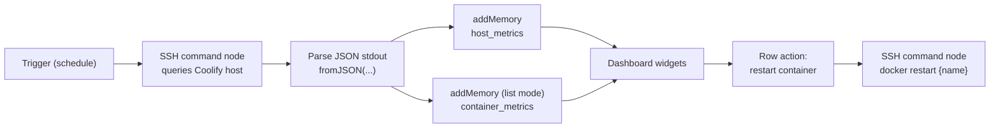

# Coolify Watcher

[](https://app.superplane.com/install?repo=github.com/superplanehq/app_coolify-watcher)

A SuperPlane app that keeps an eye on a [Coolify](https://coolify.io) host. On every poll it SSHes into the server, captures a JSON snapshot of host and container stats, stores it in canvas memory, and renders it on a live dashboard — including the ability to restart any Coolify-managed container straight from a table.

## What it does

- **Host snapshot** — CPU %, memory used/total, disk used/total, load average, and uptime from the most recent query.
- **Apps & services list** — every running container on the host (name, image, status, health, restarts, CPU/mem usage).
- **Historical trends** — CPU and memory over time, per Coolify app, so you can spot leaks and runaway processes.
- **One-click remediation** — a row action on the container tables to restart a misbehaving container without leaving the dashboard.

## How it works



1. A scheduled trigger fires the polling workflow.
2. An **SSH command** node runs a stats script on the host. It returns a single JSON document on `stdout`:

```json
{
  "ts": 1781638286,
  "host": { "cpu_pct": 22, "mem_used": 6661619712, "mem_total": 25195507712,
            "disk_used": 62515302400, "disk_total": 630872625152,
            "load": [1.98, 1.84, 1.74], "uptime_s": 4497253 },
  "containers": [
    { "name": "api-...", "image": "...", "status": "running", "health": "healthy",
      "restarts": 0, "cpu_pct": 0.07, "mem_pct": 0.37, "mem_usage": "88.22MiB / 23.47GiB", "...": "..." }
  ]
}
```

3. Because `stdout` is a JSON **string**, the workflow parses it with `fromJSON(...)` and writes the results into canvas memory (parse-on-write keeps the dashboard fields clean and queryable).

## Data model (canvas memory)

| Namespace | Granularity | Written by | Holds |
|---|---|---|---|
| `host_metrics` | one row per poll | `addMemory` (single) | `ts`, `cpu_pct`, `mem_used`, `mem_total`, `disk_used`, `disk_total`, `load1`, `uptime_s` |
| `container_metrics` | one row per container per poll | `addMemory` (list mode) | `ts`, `name`, `image`, `status`, `health`, `restarts`, `cpu_pct`, `mem_pct` |

Memory is append-only, so each poll adds history. Dashboards read the latest row per namespace for "current" panels and the full series for trend charts.

### Write expressions

Single host row (list mode **off**), e.g. fields on the `host_metrics` `addMemory` node:

```
ts        -> fromJSON($["SSH"].data.stdout).ts
cpu_pct   -> fromJSON($["SSH"].data.stdout).host.cpu_pct
mem_used  -> fromJSON($["SSH"].data.stdout).host.mem_used
mem_total -> fromJSON($["SSH"].data.stdout).host.mem_total
load1     -> fromJSON($["SSH"].data.stdout).host.load[0]
```

Per-container rows (list mode **on**) on the `container_metrics` node:

- **List Source:** `fromJSON($["SSH"].data.stdout).containers`
- **Item Variable:** `item`
- **Fields:** `name -> item.name`, `status -> item.status`, `health -> item.health`, `restarts -> item.restarts`, `cpu_pct -> item.cpu_pct`, `mem_pct -> item.mem_pct`, `ts -> fromJSON($["SSH"].data.stdout).ts`

## Dashboard

- **Host overview (number panels):** current CPU %, memory usage %, disk usage %.
  - Memory %: `{{ int(float(last.mem_used) / float(last.mem_total) * 10000 + 0.5) / 100 }}`
  - Disk %: `{{ int(float(last.disk_used) / float(last.disk_total) * 10000 + 0.5) / 100 }}`
- **Apps & services (table):** latest `container_metrics`, columns for name, status, health, restarts, CPU %, memory %. Health/status rendered with row-background rules so problem containers stand out.
- **Trends (line charts):** CPU and memory per app over time, x-axis `{{ formatDate(ts, "MM/dd HH:mm") }}` (rendered in the viewer's local timezone).
- **Last updated:** `{{ formatDate(last.createdAt, "yyyy-MM-dd HH:mm:ss") }}`.

## Container restart action

The container tables expose a **Restart** row action. It triggers a workflow that runs an SSH command against the host, targeting the selected container by name:

```
docker restart {{ name }}
```

A confirmation dialog guards the action so a restart is never a single accidental click.

## Prerequisites

- A reachable Coolify host with SSH access.
- An SSH key/credential configured in SuperPlane for the SSH component.
- A stats command on the host that emits the JSON document shown above (CPU/mem/disk + `docker stats`/`docker ps` for containers).

## Setup

1. Import / open the **Coolify Watcher** canvas in SuperPlane.
2. Configure the SSH connection (host, user, credential) on the SSH command node.
3. Point the polling trigger at your desired interval (e.g. every minute).
4. Confirm the two memory namespaces (`host_metrics`, `container_metrics`) populate after the first run.
5. Open the dashboard.

## Troubleshooting

- **Blank panels / no data:** check the SSH node's `exitCode` and `stderr`; an empty `stdout` means the stats script failed on the host.
- **Fields show raw JSON or are missing:** confirm the values were parsed with `fromJSON(...)` at write-time — dashboard CEL can't reliably drill into a parsed-JSON result inline.
- **Wrong timestamps:** use `formatDate(...)` (renders local time), not `timestamp(...)` (UTC).
- **Restart didn't take effect:** verify the SSH user can run `docker restart` (Docker group / sudo) on the host.